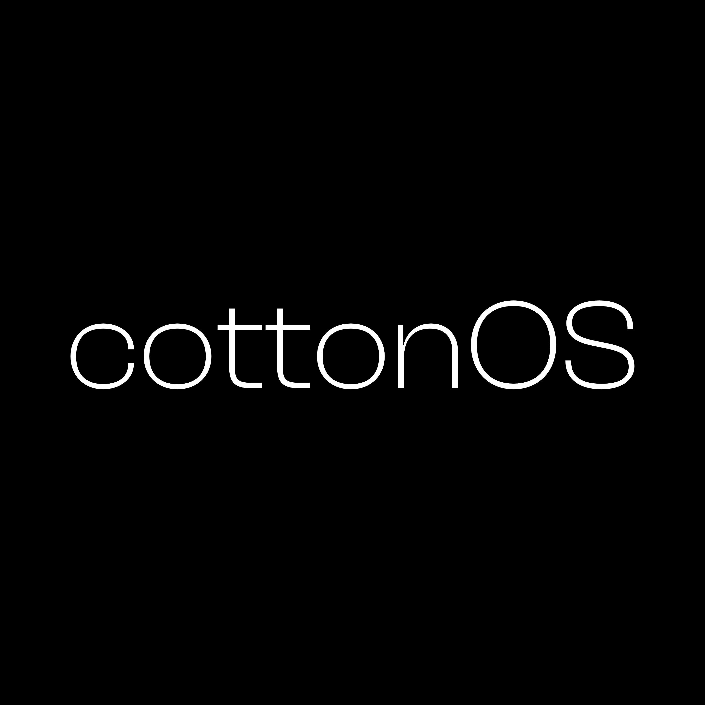
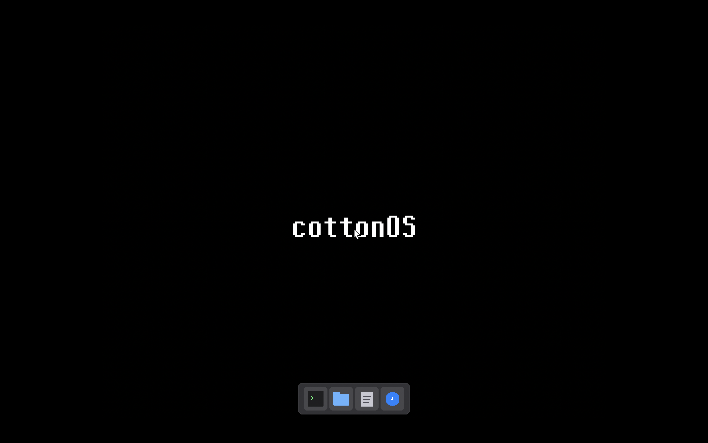
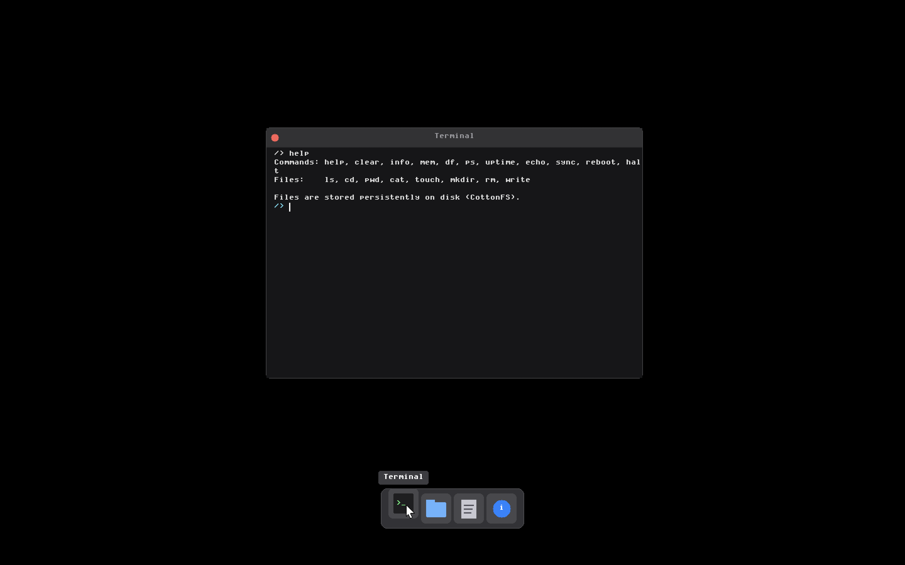
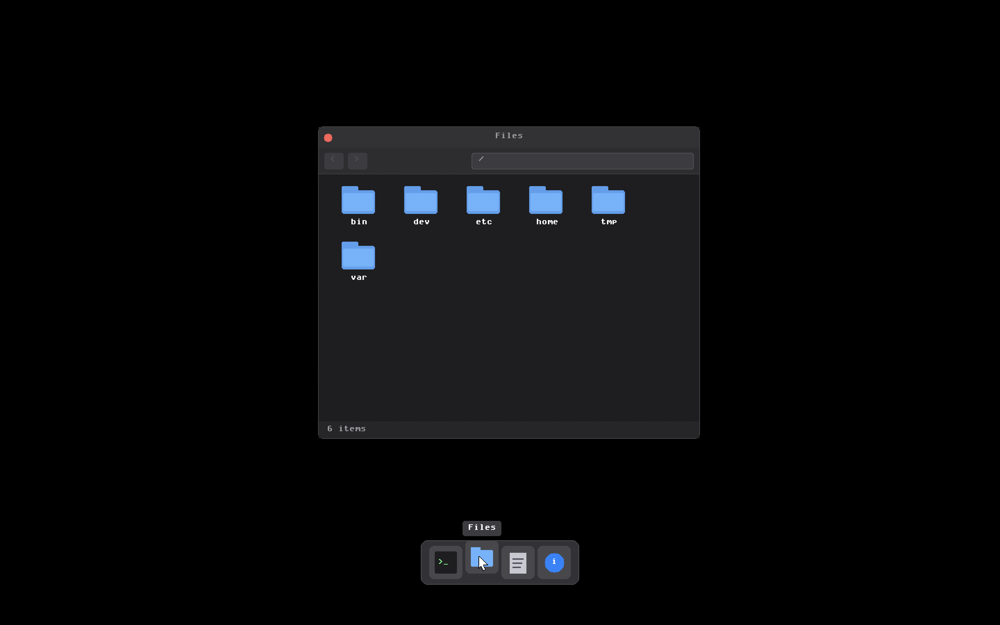
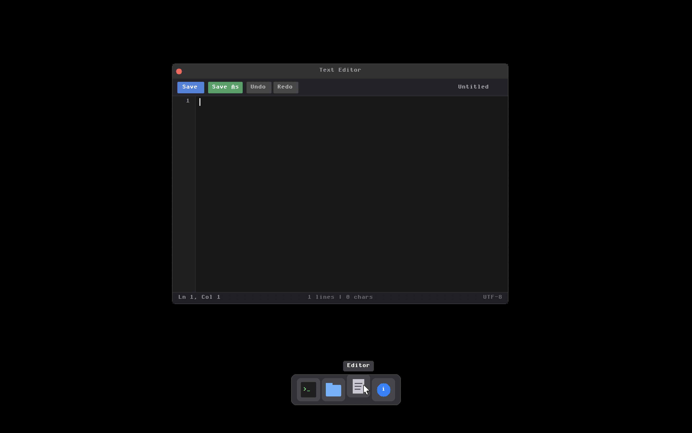
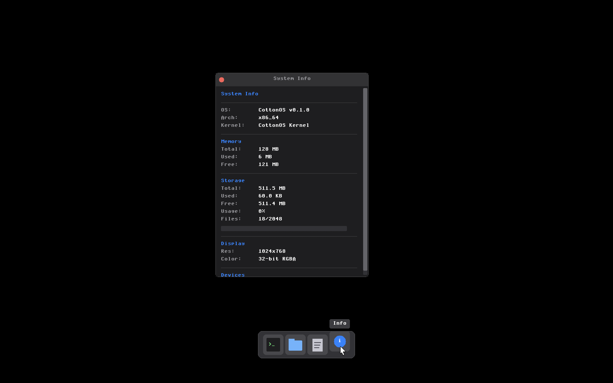

<p align="center">
  
</p>

<h1 align="center">CottonOS</h1>

<p align="center">
  <strong>A modern, from-scratch operating system kernel written in Rust</strong>
</p>

<p align="center">
  
  
  
</p>

<p align="center">
  A hobby operating system kernel written in Rust for x86_64, featuring a custom filesystem (CottonFS), 
  graphical desktop environment with window management, and full preemptive multitasking.
</p>

<p align="center">
  <strong>Author:</strong> <a href="https://github.com/aryansrao">aryansrao</a>
</p>

---

## Features

### Core Kernel Features

- **100% Rust** - Memory-safe systems programming with minimal assembly (only for boot stub)
- **Bare Metal** - No external OS dependencies, runs directly on x86_64 hardware via GRUB Multiboot2
- **Custom Filesystem** - CottonFS with persistent storage, journaling-ready design, and VFS abstraction
- **Graphical Desktop** - Full framebuffer-based GUI with window manager, taskbar, and multiple applications
- **Preemptive Multitasking** - Round-robin scheduler with 5 priority levels running at 1000Hz
- **Hardware Interrupts** - Complete x86_64 exception and IRQ handling with PIC/APIC support
- **Process & Thread Management** - Process control blocks, thread support, and process state management
- **Synchronization Primitives** - Mutexes, semaphores, and condition variables
- **System Calls** - Comprehensive syscall interface (40+ calls) for file I/O, process management, and memory operations
- **Device Drivers** - Keyboard, mouse, ATA storage, serial, and graphics drivers

### Desktop Environment

- **Window Manager** - Full window management with dragging, focus, z-order, and macOS-style controls
- **Terminal Emulator** - Integrated shell with scrollable history and command execution
- **File Manager** - Graphical file browser with directory navigation and file operations
- **Text Editor** - Multi-line editor with undo/redo, file I/O, and syntax highlighting ready
- **System Information** - Real-time display of kernel stats, memory usage, and uptime

---

## Project Goals

CottonOS is an educational and experimental project aimed at:

1. **Learning OS internals** - Understanding how operating systems work at the lowest level
2. **Rust in systems programming** - Exploring Rust's safety guarantees in kernel development
3. **From-scratch implementation** - Building everything without relying on existing OS code
4. **Modern OS design** - Implementing contemporary OS concepts (VFS, multitasking, GUI)
5. **Community & education** - Providing a well-documented reference for others learning OS development

---

## Screenshots

### Desktop Environment

<p align="center">
  
</p>

The CottonOS desktop features a clean, modern dark theme with a bottom taskbar. The desktop provides:
- **Taskbar** with application launchers (Terminal, Files, Editor, System Info)
- **Window management** with drag-to-move, focus switching, and window controls
- **Mouse cursor** with smooth tracking
- **Background** with CottonOS branding
- **Responsive UI** with immediate visual feedback

### Terminal Application

<p align="center">
  
</p>

The integrated terminal provides full shell access within the GUI environment:

**Supported Commands:**
- **Filesystem:** `ls`, `cd`, `pwd`, `cat`, `touch`, `mkdir`, `rm`, `write`
- **System Info:** `mem`, `df`, `ps`, `uptime`, `info`
- **Utilities:** `echo`, `clear`, `help`, `sync`
- **Power:** `reboot`, `halt`

**Features:**
- Scrollable output buffer with history
- Keyboard input with backspace support
- Working directory tracking
- Command history navigation (planned)
- ANSI color support (planned)

### File Manager

<p align="center">
  
</p>

The file manager provides intuitive graphical navigation of the CottonFS filesystem:

**Features:**
- **Directory listing** with file type icons (folders vs files)
- **File size display** for each entry
- **Double-click navigation** into directories
- **Back button** with navigation history
- **Path breadcrumb** showing current location
- **Scrollable list** for directories with many entries
- **File metadata** including size and type

### Text Editor

<p align="center">
  
</p>

A feature-rich text editor for creating and modifying files:

**Capabilities:**
- **Multi-line editing** with cursor positioning
- **Keyboard navigation** (arrow keys, home, end, page up/down)
- **Undo/Redo** with full operation history
- **File operations** - Open, Save, and Save As dialogs
- **Modified indicator** tracks unsaved changes
- **Line numbers** for code editing
- **Scrollable viewport** for large files
- **Syntax highlighting** support (ready for implementation)

### System Information

<p align="center">
  
</p>

The System Information panel displays real-time kernel statistics:

**Information Displayed:**
- **Kernel version** and build information
- **Architecture** (x86_64)
- **Memory statistics** - Total, used, and free RAM
- **Filesystem info** - CottonFS status, blocks, and usage
- **Uptime** counter since boot
- **Process count** from scheduler
- **CPU information** (planned: cores, frequency)
- **System metrics** (planned: temperature, load average)

---

## Building

### Prerequisites

**Required tools:**

| Tool | Purpose |
|------|---------|
| `rustup` | Rust toolchain manager |
| `nasm` | Assembler for boot stub |
| `qemu-system-x86_64` | Emulator |
| `grub-mkrescue` | ISO creation |
| `xorriso` | ISO filesystem support |
| `x86_64-elf-ld` | Cross-linker |

**macOS:**

```bash
brew install qemu nasm xorriso
brew install x86_64-elf-gcc x86_64-elf-binutils
brew install grub
```

**Ubuntu/Debian:**

```bash
sudo apt install qemu-system-x86 nasm grub-pc-bin xorriso mtools
```

**Rust toolchain:**

```bash
rustup override set nightly
rustup component add rust-src llvm-tools-preview
```

### Build Commands

```bash
# Build kernel (release mode)
make kernel

# Build kernel (debug mode)
make kernel MODE=debug

# Create bootable ISO
make iso

# Create persistent disk image (64MB)
make disk

# Clean build artifacts
make clean

# Clean everything including disk image
make clean-all
```

---

## Running

### QEMU (Recommended)

```bash
# Standard run with serial output
make run

# GUI only (no serial console)
make run-gui

# Debug mode (GDB server on :1234)
make debug

# Verbose test mode
make test
```

### Bochs

Configure `bochsrc.txt` with your paths, then:

```bash
bochs -f bochsrc.txt
```

### QEMU Options Used

```
-m 512M                     # 512MB RAM
-device VGA,vgamem_mb=64    # VGA with 64MB video memory
-serial stdio               # Serial output to terminal
-cdrom build/cottonos.iso   # Boot from ISO
-drive file=disk.img,format=raw,if=ide  # Persistent storage
```

---

## Architecture

```
+-------------------------------------------------------------------+
|                        User Space (Planned)                       |
+-------------------------------------------------------------------+
|                       System Call Interface                       |
|    exit fork exec wait getpid read write open close mkdir ...     |
+-------------------------------------------------------------------+
|                          Kernel Space                             |
|  +--------------------+  +--------------------+  +--------------+ |
|  |        GUI         |  |       Shell        |  |   Syscall    | |
|  | - Window Manager   |  | - Command Parser   |  |   Handlers   | |
|  | - Desktop          |  | - Builtins         |  |              | |
|  | - Applications     |  |                    |  |              | |
|  +--------------------+  +--------------------+  +--------------+ |
|  +--------------------+  +--------------------+  +--------------+ |
|  |    Filesystem      |  |     Process        |  |    Memory    | |
|  | - VFS Layer        |  | - Scheduler        |  | - Physical   | |
|  | - CottonFS         |  | - Process Table    |  | - Virtual    | |
|  | - DevFS            |  | - Threads          |  | - Heap       | |
|  +--------------------+  +--------------------+  +--------------+ |
|  +------------------------------------------------------------+   |
|  |                      Device Drivers                        |   |
|  |  Graphics | Keyboard | Mouse | ATA Storage | Serial | PIT  |   |
|  +------------------------------------------------------------+   |
|  +------------------------------------------------------------+   |
|  |                   Architecture (x86_64)                    |   |
|  |   GDT | IDT | Paging | PIC | APIC | CPU | MSR | I/O Ports  |   |
|  +------------------------------------------------------------+   |
+-------------------------------------------------------------------+
|                           Hardware                                |
+-------------------------------------------------------------------+
```

---

## Kernel Components

### Memory Management

**Physical Memory Allocator** (`kernel/src/mm/physical.rs`)

- Bitmap-based frame allocator
- Tracks 4KB physical frames
- Parses Multiboot2 memory map
- Reserves kernel and framebuffer regions

**Virtual Memory** (`kernel/src/mm/virtual_mem.rs`, `kernel/src/arch/x86_64/paging.rs`)

- 4-level paging (PML4 -> PDPT -> PD -> PT)
- On-demand page mapping
- Permission flags: Present, Writable, User, No-Execute
- Identity mapping for low memory
- Higher-half kernel support ready

**Kernel Heap** (`kernel/src/mm/heap.rs`)

- Uses `linked_list_allocator` crate
- Initial size: 4MB at 0x02000000
- Expandable to 16MB
- Global allocator for `alloc` crate

Memory Layout:

| Region | Address | Size |
|--------|---------|------|
| Kernel | 0x100000 | ~1MB |
| Heap | 0x02000000 | 4-16MB |
| Framebuffer | Variable | From GRUB |

### Process Management

**Process Control Block** (`kernel/src/proc/process.rs`)

```rust
pub struct Process {
    pub pid: ProcessId,
    pub ppid: Option<ProcessId>,
    pub name: String,
    pub state: ProcessState,
    pub priority: Priority,
    pub exit_status: Option<i32>,
    // ... address space, file descriptors
}
```

States: `Ready`, `Running`, `Blocked`, `Zombie`

**Scheduler** (`kernel/src/proc/scheduler.rs`)

- Round-robin with 5 priority levels
- Timer-driven preemption at 1000Hz
- Idle process when no tasks ready
- Process operations: add, remove, yield, schedule

**Threads** (`kernel/src/proc/thread.rs`)

- Kernel thread support
- Thread-local storage ready
- Stack allocation per thread

### Filesystem

**Virtual Filesystem Layer** (`kernel/src/fs/vfs.rs`)

Traits defining filesystem interface:

```rust
pub trait FileSystem: Send + Sync {
    fn root(&self) -> Result<Arc<dyn Inode>, &'static str>;
    fn sync(&self) -> Result<(), &'static str>;
    fn stats(&self) -> Result<FsStats, &'static str>;
}

pub trait Inode: Send + Sync {
    fn read(&self, offset: u64, buf: &mut [u8]) -> Result<usize, &'static str>;
    fn write(&self, offset: u64, data: &[u8]) -> Result<usize, &'static str>;
    fn lookup(&self, name: &str) -> Result<Arc<dyn Inode>, &'static str>;
    fn create(&self, name: &str, file_type: FileType) -> Result<Arc<dyn Inode>, &'static str>;
    fn unlink(&self, name: &str) -> Result<(), &'static str>;
    fn readdir(&self) -> Result<Vec<DirEntry>, &'static str>;
    // ...
}
```

**CottonFS** (`kernel/src/fs/cottonfs.rs`)

Custom persistent filesystem with the following disk layout:

| Block Range | Content |
|-------------|---------|
| 0 | Superblock |
| 1-31 | Inode bitmap (31 blocks) |
| 32-63 | Data block bitmap (32 blocks) |
| 64-127 | Inode table (64 blocks) |
| 128+ | Data blocks |

Superblock structure:

```rust
struct Superblock {
    magic: u32,           // 0x43544653 ("CTFS")
    version: u32,         // Filesystem version
    block_size: u32,      // 4096 bytes
    total_blocks: u64,
    total_inodes: u64,
    free_blocks: u64,
    free_inodes: u64,
    root_inode: u64,      // Always inode 1
    mount_count: u32,
    last_mount_time: u64,
}
```

Inode structure (128 bytes on disk):

```rust
struct DiskInode {
    mode: u16,
    file_type: u8,        // 1=file, 2=directory, 3=symlink
    uid: u32,
    gid: u32,
    size: u64,
    blocks: u64,
    atime: u64,
    mtime: u64,
    ctime: u64,
    nlink: u32,
    direct: [u64; 12],    // Direct block pointers
    indirect: u64,        // Single indirect pointer
}
```

Maximum file size: ~4MB (12 direct + 1024 indirect blocks)

**DevFS** (`kernel/src/fs/devfs.rs`)

Virtual filesystem mounted at `/dev`:
- `/dev/null` - null device
- `/dev/zero` - zero device
- `/dev/random` - random bytes (placeholder)

### Device Drivers

**Graphics** (`kernel/src/drivers/graphics.rs`)

- Framebuffer driver using GRUB-provided video mode
- Double buffering for flicker-free rendering
- Primitives: `set_pixel`, `fill_rect`, `draw_rect`, `draw_char`, `draw_string`
- 8x16 bitmap font
- Color support with alpha blending

**Keyboard** (`kernel/src/drivers/keyboard.rs`)

- PS/2 keyboard driver
- Scancode set 1 translation
- Full keycode enumeration (A-Z, 0-9, F1-F12, special keys)
- Modifier tracking (Shift, Ctrl, Alt, Caps Lock)
- Keyboard buffer with event queue

**Mouse** (`kernel/src/drivers/mouse.rs`)

- PS/2 mouse driver with scroll wheel support
- 3/4 byte packet parsing
- Button state tracking (left, right, middle)
- Relative movement with screen bounds clamping
- Scroll delta reporting

**ATA Storage** (`kernel/src/drivers/storage/ata.rs`)

- PIO mode ATA/IDE driver
- LBA28 and LBA48 addressing
- Read/write sector operations
- Drive identification (IDENTIFY command)
- Primary and secondary channel support
- Cache flush support

**Serial** (`kernel/src/arch/x86_64/serial.rs`)

- COM1 at 0x3F8
- 115200 baud, 8N1
- Debug output for kernel messages

**PIT** (`kernel/src/arch/x86_64/pit.rs`)

- Programmable Interval Timer
- 1000Hz tick rate
- System uptime tracking
- Scheduler preemption trigger

### Interrupt Handling

**GDT** (`kernel/src/arch/x86_64/gdt.rs`)

```
Entry 0: Null descriptor
Entry 1: Kernel code (64-bit, ring 0)
Entry 2: Kernel data (ring 0)
Entry 3: User code (64-bit, ring 3)
Entry 4: User data (ring 3)
Entry 5-6: TSS (16 bytes)
```

**IDT** (`kernel/src/arch/x86_64/idt.rs`)

256 entries handling:

| Vector | Exception |
|--------|-----------|
| 0 | Divide Error (#DE) |
| 1 | Debug (#DB) |
| 2 | NMI |
| 3 | Breakpoint (#BP) |
| 4 | Overflow (#OF) |
| 5 | Bound Range (#BR) |
| 6 | Invalid Opcode (#UD) |
| 7 | Device Not Available (#NM) |
| 8 | Double Fault (#DF) - uses IST1 |
| 10 | Invalid TSS (#TS) |
| 11 | Segment Not Present (#NP) |
| 12 | Stack Segment (#SS) |
| 13 | General Protection (#GP) |
| 14 | Page Fault (#PF) |
| 16 | x87 FPU Error (#MF) |
| 17 | Alignment Check (#AC) |
| 18 | Machine Check (#MC) |
| 19 | SIMD Exception (#XM) |
| 32 | PIT Timer (IRQ0) |
| 33 | Keyboard (IRQ1) |
| 44 | Mouse (IRQ12) |

**PIC** (`kernel/src/arch/x86_64/idt.rs`)

- 8259 PIC initialization
- IRQ remapping to vectors 32-47
- EOI handling

### System Calls

System call interface via `int 0x80` and `syscall` instruction:

| Number | Name | Arguments |
|--------|------|-----------|
| 0 | exit | status |
| 1 | fork | - |
| 2 | exec | path, argv |
| 3 | wait | pid |
| 4 | getpid | - |
| 5 | getppid | - |
| 6 | yield | - |
| 7 | sleep | ms |
| 10 | open | path, flags |
| 11 | close | fd |
| 12 | read | fd, buf, count |
| 13 | write | fd, buf, count |
| 14 | seek | fd, offset, whence |
| 15 | stat | path, statbuf |
| 16 | fstat | fd, statbuf |
| 20 | mkdir | path |
| 21 | rmdir | path |
| 22 | unlink | path |
| 23 | readdir | fd, dirent |
| 24 | chdir | path |
| 25 | getcwd | buf, size |
| 30 | brk | addr |
| 31 | mmap | addr, len, prot, flags |
| 32 | munmap | addr, len |
| 40 | uname | buf |
| 41 | time | - |
| 42 | uptime | - |

### Synchronization

**Mutex** (`kernel/src/sync/mutex.rs`)

- Blocking mutex with wait queue
- RAII guard pattern
- Owner tracking
- Try-lock support

**Semaphore** (`kernel/src/sync/semaphore.rs`)

- Counting semaphore
- Binary semaphore variant
- P (wait) and V (signal) operations

**Condition Variable** (`kernel/src/sync/condvar.rs`)

- Wait and notify operations
- Associated mutex support

---

## Desktop Environment

### Window Manager

The window manager (`kernel/src/gui/mod.rs`) handles:

- Window creation and destruction
- Z-order management (focus tracking)
- Window dragging via title bar
- macOS-style window controls (red/yellow/green buttons)
- Mouse event routing to focused window
- Keyboard input routing

Window structure:

```rust
pub struct Window {
    pub id: u32,
    pub title: String,
    pub x: i32,
    pub y: i32,
    pub width: u32,
    pub height: u32,
    pub visible: bool,
    pub focused: bool,
    pub dragging: bool,
    pub content: WindowContent,
}
```

### Desktop

- Black background with subtle branding
- Bottom taskbar (48px height)
- Application icons: Terminal, Files, Editor, Info
- Click-to-launch functionality
- Mouse cursor rendering

### Terminal

Terminal emulator with:

- Command input buffer
- Scrollable output history
- Shell command execution
- Working directory tracking
- ANSI-style clear support

### File Manager

Graphical file browser:

- Current path display
- Directory listing with icons
- File type differentiation
- Double-click navigation
- Back button with history
- Scroll support for large directories

### Text Editor

Modal text editor:

- Line-based buffer
- Cursor positioning (line, column)
- Insert and delete operations
- Undo stack (stores snapshots)
- Redo stack
- File I/O (open, save, save-as)
- Modified flag tracking
- Viewport scrolling

### System Information

Displays runtime statistics:

- Kernel version string
- CPU architecture
- Memory usage (physical allocator stats)
- Filesystem status
- Process count
- System uptime

---

## Shell Reference

Built-in commands available in both kernel shell and GUI terminal:

| Command | Usage | Description |
|---------|-------|-------------|
| `help` | `help [command]` | Display help information |
| `clear` | `clear` | Clear screen |
| `echo` | `echo <text>` | Print text |
| `ls` | `ls [path]` | List directory contents |
| `cd` | `cd <path>` | Change directory |
| `pwd` | `pwd` | Print working directory |
| `cat` | `cat <file>` | Display file contents |
| `touch` | `touch <file>` | Create empty file |
| `mkdir` | `mkdir <dir>` | Create directory |
| `rm` | `rm <path>` | Remove file or empty directory |
| `write` | `write <file> <text>` | Write text to file |
| `info` | `info` | System information |
| `mem` | `mem` | Memory statistics |
| `df` | `df` | Disk space usage |
| `ps` | `ps` | Process listing |
| `uptime` | `uptime` | System uptime |
| `sync` | `sync` | Flush filesystem to disk |
| `reboot` | `reboot` | Restart system |
| `halt` | `halt` | Stop CPU |

---

## Project Structure

```
CottonOS/
├── Cargo.toml                 # Workspace manifest
├── Makefile                   # Build system
├── rust-toolchain.toml        # Nightly Rust + components
├── bochsrc.txt                # Bochs emulator config
├── cottonos.png               # Logo
├── screenshots/               # Application screenshots
│   ├── home.png
│   ├── terminal.png
│   ├── files.png
│   ├── editor.png
│   └── sysinfo.png
│
├── kernel/
│   ├── Cargo.toml
│   ├── boot_stub.asm          # Multiboot2 header, GDT, page tables, long mode entry
│   └── src/
│       ├── main.rs            # Kernel entry (_start64)
│       ├── shell.rs           # Interactive shell
│       │
│       ├── arch/
│       │   ├── mod.rs         # Architecture abstraction
│       │   └── x86_64/
│       │       ├── mod.rs     # x86_64 init, port I/O, MSR access
│       │       ├── gdt.rs     # Global Descriptor Table
│       │       ├── idt.rs     # Interrupt Descriptor Table
│       │       ├── paging.rs  # Page table management
│       │       ├── pit.rs     # Programmable Interval Timer
│       │       ├── apic.rs    # APIC support
│       │       ├── cpu.rs     # CPUID, feature detection
│       │       └── serial.rs  # Serial port driver
│       │
│       ├── mm/
│       │   ├── mod.rs         # Memory subsystem init
│       │   ├── physical.rs    # Physical frame allocator
│       │   ├── virtual_mem.rs # Virtual memory management
│       │   └── heap.rs        # Kernel heap allocator
│       │
│       ├── proc/
│       │   ├── mod.rs         # Process subsystem
│       │   ├── process.rs     # Process structures
│       │   ├── scheduler.rs   # Round-robin scheduler
│       │   └── thread.rs      # Thread support
│       │
│       ├── fs/
│       │   ├── mod.rs         # Filesystem init, path resolution
│       │   ├── vfs.rs         # VFS traits and types
│       │   ├── cottonfs.rs    # CottonFS implementation
│       │   └── devfs.rs       # Device filesystem
│       │
│       ├── drivers/
│       │   ├── mod.rs         # Driver init
│       │   ├── console.rs     # VGA text console
│       │   ├── graphics.rs    # Framebuffer graphics
│       │   ├── keyboard.rs    # PS/2 keyboard
│       │   ├── mouse.rs       # PS/2 mouse
│       │   └── storage/
│       │       ├── mod.rs     # Storage abstraction
│       │       └── ata.rs     # ATA/IDE driver
│       │
│       ├── gui/
│       │   └── mod.rs         # Window manager, desktop, applications
│       │
│       ├── syscall/
│       │   ├── mod.rs         # Syscall dispatch
│       │   └── handlers.rs    # Syscall implementations
│       │
│       └── sync/
│           ├── mod.rs
│           ├── mutex.rs       # Blocking mutex
│           ├── semaphore.rs   # Counting semaphore
│           └── condvar.rs     # Condition variable
│
├── bootloader/
│   ├── Cargo.toml
│   └── src/
│       ├── lib.rs             # BootInfo structures
│       └── vga.rs             # Early VGA output
│
├── userspace/
│   ├── Cargo.toml
│   └── src/
│       ├── lib.rs
│       ├── shell.rs           # Userspace shell (planned)
│       └── syscall.rs         # Syscall wrappers
│
├── linker/
│   ├── x86_64_direct.ld       # Direct boot linker script (1MB load)
│   └── x86_64.ld              # Higher-half linker script
│
└── .cargo/
    ├── config.toml            # Cargo build configuration
    └── x86_64-cottonos.json   # Custom target specification
```

---

## Technical Reference

### Boot Sequence

1. GRUB loads kernel ELF via Multiboot2 at 1MB physical
2. `boot_stub.asm` executes:
   - Sets up stack at `stack_top`
   - Initializes GDT with 64-bit code segment
   - Creates identity-mapped PML4 page tables
   - Enables PAE (CR4.PAE)
   - Loads PML4 into CR3
   - Enables long mode (EFER.LME)
   - Enables paging (CR0.PG)
   - Far jumps to 64-bit code
3. `_start64` (Rust entry):
   - Initializes serial for debug output
   - Parses Multiboot2 info structure
   - Extracts framebuffer parameters
   - Calls architecture init (IDT, paging refinement, PIT)
   - Initializes memory management
   - Initializes filesystem (mounts CottonFS)
   - Initializes process management
   - Starts device drivers
   - Launches GUI or shell

### Memory Map

```
0x00000000 - 0x000FFFFF : Low memory (BIOS, VGA)
0x00100000 - 0x001FFFFF : Kernel code and data (~1MB)
0x00200000 - 0x01FFFFFF : Available
0x02000000 - 0x02FFFFFF : Kernel heap (16MB max)
0x03000000 - ...        : Available for allocation
Variable                : Framebuffer (GRUB-provided)
```

### CottonFS Constants

```rust
const BLOCK_SIZE: usize = 4096;
const FS_MAGIC: u32 = 0x43544653;  // "CTFS"
const FS_VERSION: u32 = 2;
const MAX_INODES: u64 = 2048;
const MAX_FILENAME: usize = 60;
const DIRECT_BLOCKS: usize = 12;
const ROOT_INODE: u64 = 1;
```

### Interrupt Configuration

```
PIC1 command: 0x20, data: 0x21
PIC2 command: 0xA0, data: 0xA1
IRQ0-7  -> vectors 32-39
IRQ8-15 -> vectors 40-47
```

---

## Build Targets

| Target | Description |
|--------|-------------|
| `make` | Build kernel (release) |
| `make kernel` | Build kernel |
| `make iso` | Create bootable ISO |
| `make disk` | Create 64MB disk image |
| `make run` | Run in QEMU with serial |
| `make run-gui` | Run in QEMU (GUI only) |
| `make debug` | Run with GDB server |
| `make test` | Verbose QEMU output |
| `make verify` | Check kernel ELF |
| `make clean` | Remove build artifacts |
| `make clean-disk` | Remove disk image |
| `make clean-all` | Full clean |
| `make fmt` | Format code |
| `make clippy` | Run linter |

---

## Dependencies

| Crate | Version | Usage |
|-------|---------|-------|
| `spin` | 0.9 | Spinlock-based synchronization |
| `bitflags` | 2.4 | Bit flag definitions |
| `volatile` | 0.5 | Volatile memory access |
| `linked_list_allocator` | 0.10 | Heap allocation |
| `lazy_static` | 1.4 | Lazy static initialization |


**CottonOS** - A hobby OS by [aryansrao](https://github.com/aryansrao)
